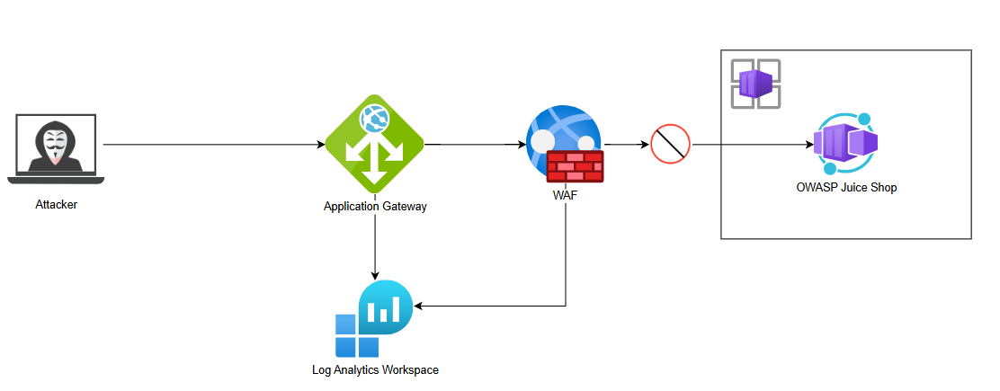
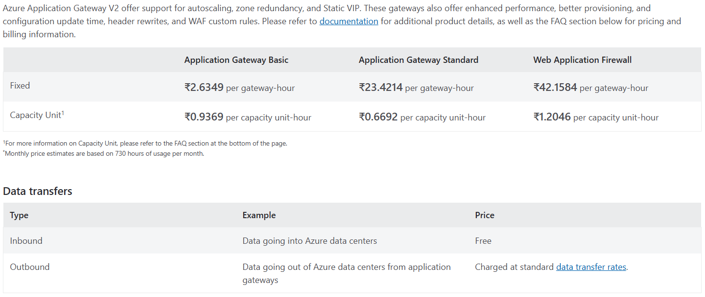
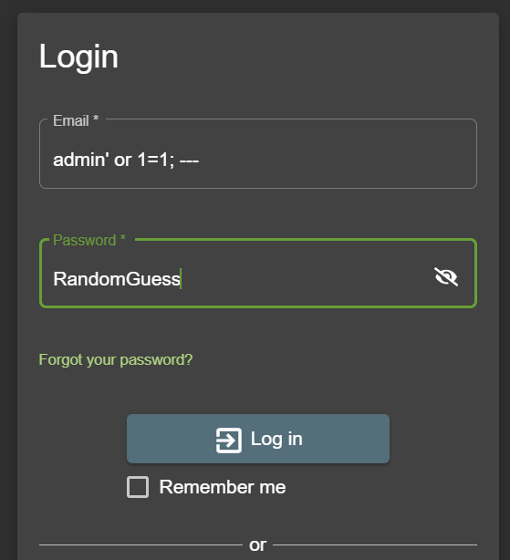
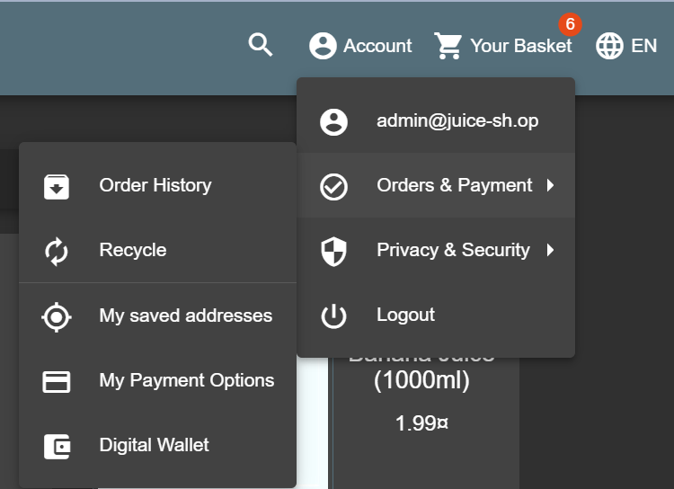
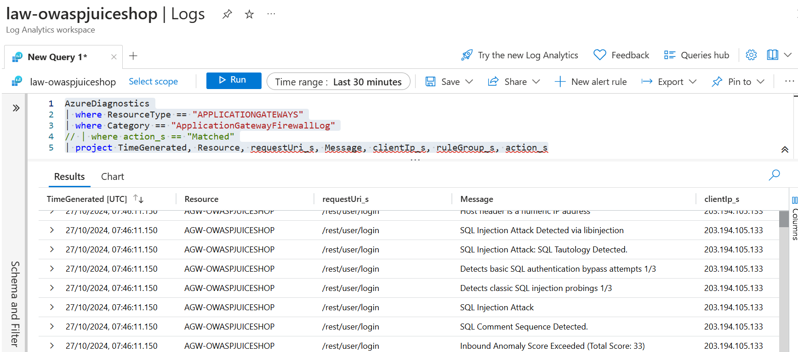
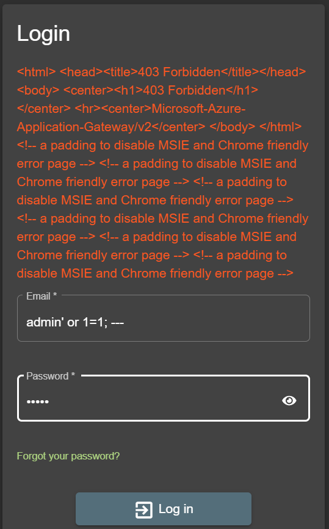
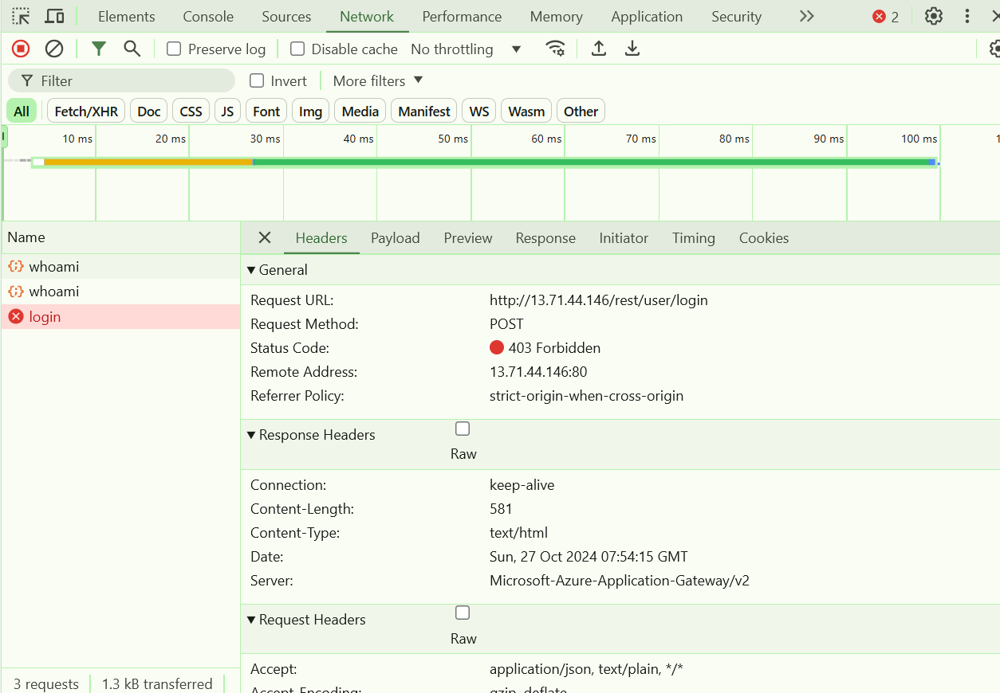
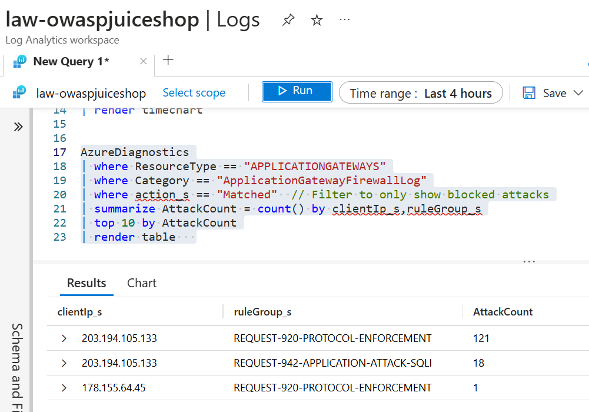

# Azure WAF Proof of Concept

In this PoC we will:
- Provision and configure Application Gateway WAF v2, Azure Container Apps, Azure Log Analytics Workspace using Terraform
- Deploy [OWASP Juice Shop](https://github.com/juice-shop/juice-shop) (a deliberately vulnerable application) to Azure Container Apps.
- Set the WAF mode to "DETECT" (this mode only "detects" the attacks, doesn't prevent/block it).
- Perform SQL Injection attack to gain admin access.
- Observe the logs in Azure Log Analytics.
- Set the WAF mode to "PREVENT" (this mode will detect and prevent the attacks)
- Again perform the SQL Injection attack and observe the logs

## Requirements
1. Github Account
2. Azure Account
3. Service Principal configured for authentication, grant `CONTRIBUTOR` role on the subscription. (NOT RECOMMENDED FOR PRODUCTION)

## Pricing Considerations

Azure Application Gateway WAF v2 is a costly azure service, below table shows the cost for `Central India`

## Setup
1. Clone this repository.

2. Create 4 Github Actions Secrets.

| Secret Name | Description |
| --- | --- |
| ARM_CLIENT_ID | Service Principal's Client ID |
| ARM_CLIENT_SECRET |  Service Principal's Client Secret |
| ARM_TENANT_ID | Azure Active Directory's Tenant ID |
| ARM_SUBSCRIPTION_ID | Azure Subscription ID |

3. Go to `Actions` tab in Github.

4. Select the workflow `OWASP Juice Shop Deploy Infrastructure` from the side menu and run the workflow.

## Destroy

1. Go to `Actions` tab in Github.

2. Select the workflow `OWASP Juice Shop Desctory Infrastructure` from the side menu and run the workflow.

## Observations

### DETECTION mode

Performing SQL Injection on Login page's input field to get admin access.

Logged in successfully as admin.

Azure Log Analytics detected the injection attack.

### PREVENTION mode

SQL Injection blocked by the application gateway.

Detailed response in Developer Console.

Report summary of the attack attempts in Log Analytics.

